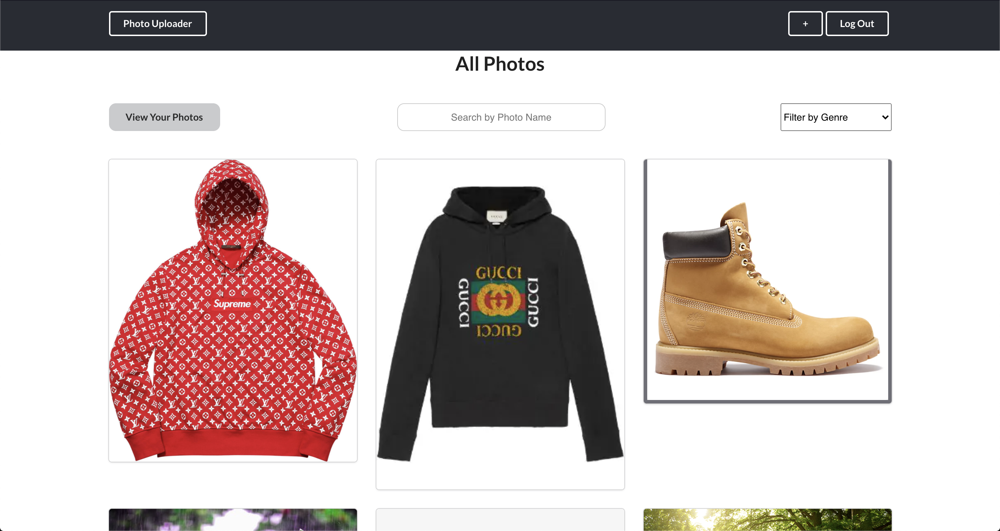

This project was bootstrapped with [Create React App](https://github.com/facebook/create-react-app).

# Photo Uploader App 📷
Photo Uploader is a full stack web application that allows the user to view photos uploaded by other users. Users can comment/like photos and filter/search which genres they would like to see.

* [Deployed Version](https://photo-uploader-react.herokuapp.com/)
* [Video Demo](https://www.youtube.com/watch?v=QMpfjpzMgsc)
* [Server-side Repo](https://github.com/reireynoso/photo-mern) 

# Getting Started
Before setting up, make sure the server is installed along with Node.js and NPM

## Prerequisites
If it is not installed, go in your terminal, and follow the steps:

1. Install the [server](https://github.com/reireynoso/photo-mern) 
2. Install [Node and NPM](https://www.npmjs.com/get-npm)

## Setup

From your terminal,

1. Clone the repo and `cd` into the folder
2. Install dependencies with `npm install`
3. Launch the server first with `npm run dev` and run the react application with `npm run dev`

# Features
- Viewing photos uploaded
- Commenting on photos
- Liking photos
- User authentication/authorization
- Image upload for user
- User updating information including password
- Filter/Search functionality for viewing photos

# Built With
* React
* Semantic UI 
* NodeJS/Express (API)

# Tools
* Semantic UI
* Cloudinary
* JSON Web Tokens

# Authors
Reinald Reynoso